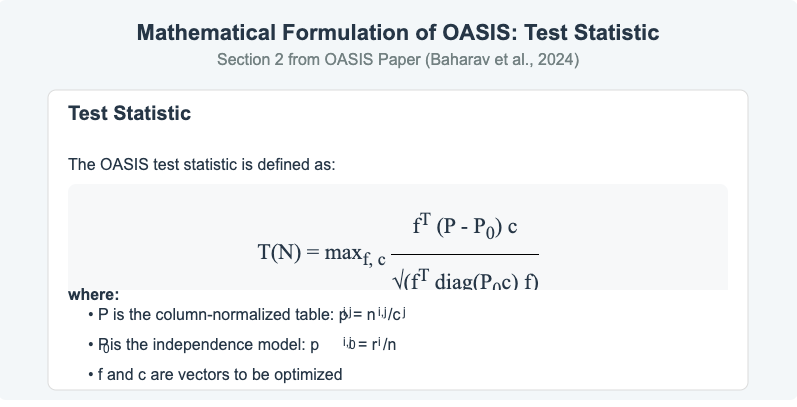
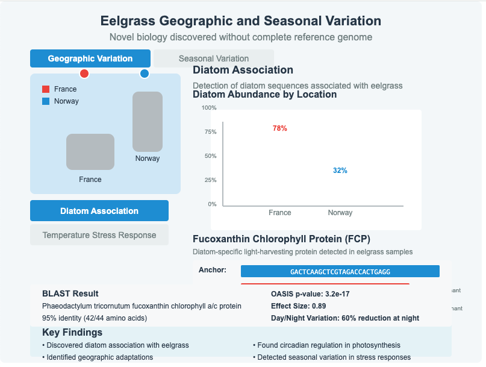

## Review of two Publications

- **SPLASH**: "A statistical, reference-free genomic algorithm unifies biological discovery" (Chaung et al., 2023, Cell)
  - Introduces a reference free genomic analysis method
  
- **OASIS**: "An interpretable, finite-sample valid alternative to Pearson's X² for scientific discovery" (Baharav et al., 2024, PNAS)
  - Provides the statistical framework underpinning SPLASH's methodology
  
<!--
- **Henderson et al. 2024**: "Ultra-efficient, unified discovery from microbial sequencing with SPLASH and precise statistical assembly"
  - Extends SPLASH to microbial applications with enhanced capabilities
-->

---

<!-- Copy from splash_oasis_methodology_presentation_v2.md -->

<!--
# SPLASH & OASIS Methodology
## Understanding Reference-Free Genomic Analysis
- - -
-->

## Genomics today: distorting a signal foundational to biological discovery and medicine?$^1$

- Operating in a paradigm designed for a different era of data and sampling
- Not fully statistical or mathematical$^2$.
- No unification across "microniches" of biology$^3$.
- Reference-dependent$^4$.
- Missing biology
- (Computationally intensive)
- Not AI ready

---

- 1: [Dr. Salzman's CGSI 2024 talk](https://youtu.be/nHuc5mlQRQw?t=64).    

- 2: An algorithm doesn't have to be statistical or mathematical to work well.  

- 3: Do we expect a one-size-fits-all
peri-omic solution common to microniches of biology?

- 4: 
The alignment of reads to a
known sequence provides a powerful QC/QA element.  

  - The lack of discussion of data quality and how
quality will impact the results produced by the proposed algotihtm
is a significant omission from the report.  

  - The shallowness of the evaluation does not inform on this critical point.

---

## Why We Need a Reference-Free Approach

- **Reference genomes have fundamental limitations**:
  - Incomplete representation of genetic diversity
  - Missing sequences from understudied populations
  - Poor handling of highly variable regions

- **Alignment-based approaches**:
  - Computationally expensive
  - Struggle with repetitive elements (54% of hg)
  - Cannot detect what's not in the reference
  - Limit discovery of novel biology

- **The SPLASH solution**: Direct *statistical analysis*$^1$
of raw sequence data using anchor-target structure

---

- 1: *statistical analysis* here means
computing a number for each target and identifying targets based on these.
 
---

## Why the Anchor-Target Structure Works

- **Biological signal is inherently structured**: 
  - Variation occurs in specific patterns adjacent to conserved regions
  - Most biological variation follows this pattern:
    - Alternative splicing: constant exons with variable junctions
    - Genetic variants: stable regions with point mutations
    - Microbial diversity: conserved genes with variable regions

---

- **Sensitivity through structure**:
  - Anchors provide context for variation
  - Targets capture the biologically meaningful differences
  - Enables detection of patterns without prior knowledge
  - Works across diverse biological domains

- **Unified mathematical framework**:
  - *Contingency tables*$^1$
of anchor-target pairs
  - Same approach applies to viruses, human cells, non-model organisms

---

- 1: A contingency table is a way
succinctly summarize sample counts which can be cross-classified by
2 categorical variables.  The contingency table summarization does
not confer any analytical advantage other than providing a natural
and sufficient set of summary statistics  and a way to 
compute chi-squared statistics.

---

## SPLASH: The Fundamental Concept

---

- **S**tatistically **P**rimary a**L**ignment **A**gnostic **S**equence **H**oming
- Directly analyzes raw sequencing data
- Detects sample-specific sequence variation without alignment
- Unifies detection of multiple forms of sequence variation

---

## SPLASH: How It Works

1. **Extract k-mers (anchors and targets)**
   - Anchor: fixed sequence (k nucleotides long)
   - Target: adjacent sequence (also k nucleotides)

2. **Build contingency tables**
   - Rows: Different targets
   - Columns: Different samples/conditions
   - Cells: Counts of anchor-target pairs

3. **Apply statistical test**
   - Originally used chi-squared test; Now uses OASIS
   - Identifies **statistically significant** sample-specific 
variation$^1$

---

- 1: The identification step
is application specific  and should be set empirically; 
significance is just one option for identification,
and is rarely the best way to identify features of interest.

---

## Limitations of Current Statistical Tests

- **Pearson's chi-squared test**^[Not state of the art]
requires expected cell counts ≥5 for valid inference
  - Unreliable for sparse tables 
  - Provides little insight into *which* rows/columns drive differences
  - Computationally inefficient for large tables

- **Log-linear models**:
  - Limited by asymptotic approximations
  - Require iterative procedures that may not converge
  - Poor performance with sparse data

---

## Limitations of Current Statistical Tests (cont'd)

- **Exact tests** (Fisher's, Barnard's, etc.):
  - Computationally prohibitive for large tables
  - Often too conservative for genomic applications
  - Limited interpretability

- **Permutation-based approaches**:
  - Computationally expensive
  - May not provide closed-form p-values
  - Challenging to scale to large datasets

---

## Mathematical Formulation of OASIS

---

---

---

---

---

- **Problem setup**: Given contingency table $N = [n_{i,j}]$ with row sums $r_i$ and column sums $c_j$
  - Rows represent targets (sequences)
  - Columns represent samples/conditions
  - Cells contain counts of anchor-target pairs

- **Test statistic**: 
  $$T(N) = \max_{f, c} \frac{f^T (P - P_0) c}{\sqrt{f^T \text{diag}(P_0 c) f}}$$

  Where:
  - $P$ is the column-normalized table: $p_{i,j} = \frac{n_{i,j}}{c_j}$
  - $P_0$ is the independence model: $p^0_{i,j} = \frac{r_i}{n}$
  - $f$ and $c$ are vectors to be optimized

---

- **Interpretation**: Measures deviation from independence model, *optimized for maximum sensitivity*

---

## Optimization-Based Approach to $f$ and $c$

- **Mathematical objective**:
  - Find vectors $f$ and $c$ that maximize the test statistic $T(N)$
  - Must handle high-dimensional, sparse data efficiently
  - Need interpretable results for biological insight

---

- **Optimization method**:
  - OASIS uses singular value decomposition (SVD) of normalized residual matrix
  - $f$ is the left singular vector corresponding to largest singular value
  - $c$ is the right singular vector corresponding to largest singular value

- **Computational advantages**:
  - Closed-form solution via SVD
  - Highly efficient even for large tables
  - *Provable guarantees on statistical power*

---

## OASIS in Practice: Example Computation

Given a contingency table of anchor-target pairs across samples:

1. **Normalize the table** by column sums to get matrix $P$
2. **Compute expected counts** under independence model $P_0$
3. **Apply SVD** to the normalized residual matrix $(P - P_0)$
4. **Extract vectors** $f$ and $c$ from first singular vectors
5. **Compute test statistic** $T(N)$ using optimized $f$ and $c$
6. **Calculate p-value** using closed-form bounds or asymptotic distribution

This approach provides both *statistical rigor* and *biological interpretability*^[
Thes words are not supported by much empirical evidence.]

---

<!-- 

## Comparing Methodologies: OASIS vs Chi-Squared

---

| Feature | Chi-Squared Test | OASIS |
|---------|-----------------|-------|
| Finite sample validity | No | Yes |
| Computational efficiency | Good | Excellent |
| Interpretability | Limited | High |
| Performance with sparse data | Poor | Good |
| Closed-form P-values | No | Yes |
| Asymptotic validity | Yes | Yes |

---

-->

## For Biologists: Why This Matters

- **Unbiased discovery** + **Unbiased false discovery**
  - Not limited to what's in reference genomes
  - Captures biological variation missed by standard methods

- **Biological interpretation**
  - Protein domain profiling without reference
  - Sample-specific sequence variation relates directly to biological function

---

- **Applied examples**:
  - Detection of RNA splicing variations 
  - Identification of pathogen strain differences
  - Analysis of immune receptor diversity

---

## For Bioinformaticians: Technical Benefits 

- **Computational efficiency**
  - Avoids computationally expensive alignment
  - Scales to large datasets

- **Statistical Benefits**$^1$:
  - OASIS provides finite-sample valid statistics
  - Closed-form P-value calculations avoid permutation testing
  - Controls for multiple testing

--- 

-  1:  I'm not sure I beleve this
and it doesn't matter.
All we need is that the statistics provide a useful index which
can be used to identify interesting targets.

---

- **Algorithmic implementation**
  - SPLASH2: C++/Python implementation with enhanced efficiency
  - Compactors: Statistical approach to local seed-based assembly

---

## Example 1: SARS-CoV-2 Variant Detection

---

- **Discovery process**:
  - SPLASH identified anchors with sample-specific targets across SARS-CoV-2 sequences
  - Without reference genome or metadata, detected strain-defining mutations
  
---

- **Anchor-target advantage**:
  - Anchors located in conserved regions (same across strains)
  - Targets captured variant-specific mutations
  - Statistical testing showed which variants were **significantly associated with** different samples/timepoints
  
- **Biological insight**  (how often does a biologist not)
  - Protein domain profiling revealed key affected proteins (spike, ORF7a, etc.)
  - Detected mutations in functional domains like receptor binding domain
  - Clustered samples by strain without prior knowledge of strain definitions

---

## Example 2: Single-Cell RNA Alternative Splicing

---

- **Discovery process**:
  - SPLASH applied to Smart-Seq2 single-cell RNA-seq data
  - Identified cell-type specific splicing 
  
- **Anchor-target advantage**:
  - Anchors captured exon-exon junctions
  - Different targets represented alternative splice events
  - Target distribution patterns revealed cell-type specificity

---
  
- **Biological insight**:
  - Detected known MYL6 alternative splicing as validation
  - Discovered previously unrecognized splicing events
  - Identified cell-type specific expression of HLA-DRB1 vs HLA-DRB4 paralogs
  - Revealed single-cell level variation in HLA-B allele expression

---

## Example 3: Octopus Tissue-Specific Transcripts

---

- **Discovery process**:
  - SPLASH applied to RNA-seq from different octopus tissues
  - No comprehensive reference transcriptome available
  
- **Anchor-target advantage**:
  - Anchors with tissue-specific target distributions revealed tissue-specific transcripts
  - In-silico translation and protein domain analysis without reference
  - Detected novel splicing patterns missed by reference-based approaches
  
---

- **Biological insight**:
  - Identified neural-specific isoforms of tropomyosin
  - Discovered muscle-specific isoforms of myosins and actins
  - Found light-responsive transcripts in photoreceptive tissues
  - Revealed novel tissue-specific isoforms absent from reference genome

---

## Example 4: Eelgrass Geographic and Seasonal Variation

---

- **Discovery process**:
  - SPLASH applied to RNA-seq from eelgrass collected at different locations and seasons
  - Reference genome available but incomplete
  
- **Anchor-target advantage**:
  - Anchors with location-specific targets revealed geographic adaptations
  - Seasonal-specific target distributions identified circadian and seasonal regulation
  - Anchors with no matches to reference revealed novel biology

---
  
- **Biological insight**:
  - Discovered diatom association through protein domain analysis
  - Identified fucoxanthin chlorophyll proteins showing day/night variation
  - Detected geographic adaptations between Norway and France populations
  - Found seasonal variations related to light adaptation

---

## Conclusion: A New Paradigm which may or may not...

- **Unified approach** to genomic analysis
- **Reference-free discovery** enables novel findings
- **Statistical rigor** through OASIS methodology
- **Computationally efficient** analysis at scale
- **Biologically interpretable** results
- **Future directions**: Expanding to additional omics technologies

---

## More Rigorous Assessments are Needed

- **Current evaluation approaches are insufficient for omics-scale methods**:
  - Limited benchmarks that don't reflect real-world complexity
   - Need a battery of objective benchmarks
which reflect meaningful endpoints
 
---

- **A holistic assessment framework should include**:
  - Datasets reflecting end-to-end process variability
  - Samples from varied sources and conditions
  - Battery of meaningful metrics measuring field performance
  - Comprehensive comparison with all competing methods

---

## Variability - Variability - Variability

- The full range of data quality which may be present
in successful RNASeq data sets must be accounted for.

- The presence of unwanted variability must also be
accounted for in the design and evaluation steps.

- See Molania et. al (2023) for indication of
the extent and impact of unwanted variability in RNA-Seq data,
and ways to remove it.

<!--
- I expect unwanted variability to be a more formidable threat
to validity in a reference-free context as the mapping of sequences 
to a reference already filter a lot of the bad stuff.
-->

## TO DO

- Everything that this study glossed over -
variability regimes which come with the omic territory

---

## References

1. Chaung et al. (2023). SPLASH: A statistical, reference-free genomic algorithm unifies biological discovery. *Cell*, 186(25), 5440-5456. DOI: 10.1016/j.cell.2023.10.028

2. Baharav et al. (2024). OASIS: An interpretable, finite-sample valid alternative to Pearson's X² for scientific discovery. *PNAS*, 121(15), e2304671121. DOI: 10.1073/pnas.2304671121

3. Henderson et al. (2024). Ultra-efficient, unified discovery from microbial sequencing with SPLASH and precise statistical assembly. *bioRxiv*. DOI: 10.1101/2024.01.18.576133

4. Molania, R., Foroutan, M., Gagnon-Bartsch, J.A., Gandolfo, L.C., Jain, A., Sinha, A., Olshansky, G., Dobrovic, A., Papenfuss, A.T., and Speed, T.P. (2023). Removing unwanted variation from large-scale RNA sequencing data with PRPS. Nature Biotechnology 41, 82–95. Available at: https://doi.org/10.1038/s41587-022-01440-w.

## Resources

- GitHub repository: [https://github.com/refresh-bio/SPLASH](https://github.com/refresh-bio/SPLASH)
- Salzman Lab: [http://salzmanlab.stanford.edu/](http://salzmanlab.stanford.edu/)

<!--
    
    
 nohup Rscript -e "rmarkdown::render('splash_oasis_methodology_presentation_v2.Rmd')" > splash_oasis_methodology_presentation_v2.log  &
  
-->

