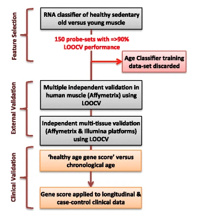

```{css sidenote, echo = FALSE}

.main-container {
    margin-left: 250px;
}
.sidenote, .marginnote { 
  float: right;
  clear: right;
  margin-right: -40%;
  width: 37%;         # best between 50% and 60%
  margin-top: 0;
  margin-bottom: 0;
  font-size: 1.1rem;
  line-height: 1.3;
  vertical-align: baseline;
  position: relative;
  }
```


<style>
@import url('https://fonts.googleapis.com/css?family=Raleway');
@import url('https://fonts.googleapis.com/css?family=Oxygen');
@import url('https://fonts.googleapis.com/css?family=Raleway:bold');
@import url('https://fonts.googleapis.com/css?family=Oxygen:bold');

.main-container {
  max-width: 1400px !important;
}

body{
  font-family: 'Oxygen', sans-serif;
  font-size: 16px;
  line-height: 24px;
}

h1,h2,h3,h4 {
  font-family: 'Raleway', sans-serif;
}

.container { width: 1400px; }

caption {
  font-size: 20px;
  caption-side: top;
  text-indent: 30px;
  background-color: lightgrey;
  color: black;
  margin-top: 5px;
}

g-table-intro h4 {
  text-indent: 0px;
}
</style>

```{r setup, include = FALSE}
knitr::opts_chunk$set(echo = TRUE,
                      comment = NA,
                      warning = FALSE,
                      error = FALSE,
                      message = FALSE,
                      cache = FALSE,
                      fig.width = 8,
                      fig.height = 4)
```

```{r m2a-GlobalOptions, results="hide", include=FALSE, cache=FALSE}

knitr::opts_knit$set(stop_on_error = 2L) #really make it stop
options(knitr.table.format = 'html')

options(stringsAsFactors=F)

 #knitr::dep_auto()

```
<!-- ######################################################################## -->


```{r m2a-Prelims,  include=FALSE, echo=FALSE, results='hide', message=FALSE} 

FN <- "_M2A-ref_free_genomic_inf"
if(sum(grepl(FN, list.files()))==0) stop("Check FN")

 suppressMessages(require(rmarkdown))
 suppressMessages(require(knitr))

 suppressPackageStartupMessages(require(methods))
 suppressPackageStartupMessages(require(bookdown))

 suppressPackageStartupMessages(require(data.table))
 options(datatable.fread.datatable=F)

 suppressPackageStartupMessages(require(plyr))
 suppressPackageStartupMessages(require(dplyr))
 suppressPackageStartupMessages(require(magrittr))

 # Shotcuts for knitting and rendering while in R session (Invoke interactive R from R/Scripts folder)
 kk <- function(n='') knitr::knit2html(paste("t", n, sep=''), envir=globalenv(),
       output=paste(FN,".html", sep=''))

 rr <- function(n='') rmarkdown::render(paste("t", n, sep=''), envir=globalenv(),
       output_file=paste(FN,".html", sep='')) ##, output_dir='Scripts')

 bb <- function(n='') browseURL(paste(FN,".html", sep=''))

 # The usual shortcuts
 zz <- function(n='') source(paste("t", n, sep=''))


 WRKDIR <- '..'
 if(!file.exists(WRKDIR)) stop("WRKDIR ERROR", WRKDIR)

 # do once

 # Shotcuts for knitting and rendering while in R session
 kk <- function(n='') knitr::knit2html(paste("t", n, sep=''), envir=globalenv(),
       output=paste('',FN,".html", sep=''))

 rr <- function(n='') render(paste("t", n, sep=''), envir=globalenv(),
       output_file=paste(FN,".html", sep=''), output_dir='Scripts')

 bb <- function(n='') browseURL(paste('',FN,".html", sep=''))

 # The usual shorcuts
 zz <- function(n='') source(paste('', "t", n, sep=''))

 # file rmarkdown file management options: cache, figures
 cache_DIR <- file.path(WRKDIR,'Scripts', 'cache/M2A/')
 suppressMessages(dir.create(cache_DIR, recursive=T))
 opts_chunk$set(cache.path=cache_DIR)

 figures_DIR <- file.path(WRKDIR,'Scripts', 'figures/M2A/')
 suppressMessages(dir.create(figures_DIR, recursive=T))
 opts_chunk$set(fig.path=figures_DIR)

 #tables_DIR <- file.path(WRKDIR,'Scripts', 'tables/M2A/')
 #suppressMessages(dir.create(table_DIR, recursive=T))
 #opts_chunk$set(fig.path=table_DIR)
 
 # need a local copy of help_DIR
 #help_DIR <- file.path(WRKDIR,'Scripts', 'help_files')
 help_DIR <- file.path('.', 'help_files')
 suppressMessages(dir.create(help_DIR, recursive=T))
 
 temp_DIR <- file.path(WRKDIR,'Scripts', 'temp_files')
 suppressMessages(dir.create(temp_DIR, recursive=T))

```
<!-- ######################################################################## -->

*** 

```{r m2a-utilityFns, echo=FALSE}
 # Here we define some utility functions
source('r/utilityFns.r')

```

<!-- ######################################################################## -->


<!-- SKIP THIS 
# Params {#params}

## Input params {-}
-->

```{r m2a-input-params-all, echo = FALSE, results = "asis", eval=F, echo=F}
 # print out original input params
data.frame(
param_name=names(params),
param_value=unlist(params),
param_class=sapply(params, class), row.names=NULL) %>%
  knitr::kable(caption="Input Parameters")
```

<br/>


<!--
* Breiman: [@Breiman:1984aa; @Breiman:2001aa]
* Freedman: [@Freedman:2008aa; @Freedman:2008ad; @Freedman:2008ac; @Freedman:2009ac]
-->

## Preliminaries {-}

* chatGPT query:
   - what is the best GPT based tool to obtain definitions of technical terms used in biotech related scientific publications?

* Response

### Best GPT-based tools for defining technical terms in biotech-related scientific publications:

| Tool | Strengths | Ideal Usage |
|------|-----------|-------------|
| **[SciSpace Copilot](https://scispace.com)** | - Contextual definitions within scientific papers<br>- Highly accurate for biotech terms<br>- Integrated directly into research PDFs | Immediate comprehension within biotech research papers |
| **[Elicit.org](https://elicit.org)** | - GPT-powered scientific research assistant<br>- Simplifies technical jargon into plain language<br>- Effective for quick clarification | Rapid clarification and concise definitions |
| **[Explainpaper](https://www.explainpaper.com)** | - GPT-driven academic language translator<br>- Clear, user-friendly explanations of complex biotech concepts | Students or researchers seeking straightforward definitions |
| **[Consensus](https://consensus.app)** | - Aggregates and summarizes definitions from multiple scientific papers<br>- Provides context-aware definitions within the broader biotech field | Cross-validating definitions across multiple sources |

#### Recommended overall choice:
- ✅ **[SciSpace Copilot](https://scispace.com)** is the best overall choice for its contextual accuracy and specialized biotech literature integration. 

**Alternatives:** Use **Elicit** or **Consensus** if definitions from broader perspectives or cross-validation across sources is desired.

<br/>


# Introduction

* The [Salzman Lab](https://salzmanlab.stanford.edu/) 
develop and apply new **statistical algorithms** for **biological inference**
on fundamental questions in the evolution of genomes.

<p><p/>
* In this report we focus on two papers from the 
[Salzman Lab](https://salzmanlab.stanford.edu/):
   - SPLASH: A statistical, reference-free genomic algorithm unifies biological discover
[PDF](https://www.cell.com/cell/pdf/S0092-8674(23)01179-0.pdf),
[Code](https://github.com/refresh-bio/SPLASH) [@Chaung:2023AA]
   - OASIS: An interpretable, finite-sample valid alternative to Pearson’s X2 
for scientific discovery
[URL](https://www.pnas.org/doi/10.1073/pnas.2304671121),
[Code](https://github.com/refresh-bio/SPLASH) [@Baharava:2014aa]


# Outline 

<p><p/>
* In Section \@ref(GPT-based-res) we prompt **chatGPT** to compare the following
research assistant tools:
   - **Scholar GPT, Concensus, SciSpace, Semantic Scholar, Perplexity, Elicit**

<p><p/>
* In Section \@ref(soa-ref-free-genomics), we use **Concensus** to obtain a
literature review summarizing the state of the art in reference-free genomics.


<p><p/>
* In Section \@ref(splash-ai-review) we prompt **chatCPT** and **SciSpace** to provide a
technical review of Chaung et al. (2023) [@Chaung:2023aa].  Here,
   - **does** the AI assistants get some key concepts wrong while maintaining 
a steady tone of confidence.

<p><p/>
* In the next Section, \@ref(splash-ai-review-with-line-ref), we prompt
**chatCPT and **SciSpace** to provide line references for all claims or attributions
made regarding the article.
   - How much does the response change?


<p><p/>
* In Section \@ref(oasis-ai-review) we prompt **chatCPT** and **SciSpace** to provide a
technical review of Baharava et al. (2024) [@Baharava:2024aa].
**Does** the AI assistants get some
key concepts wrong while maintaining a steady tone of confidence.

<p><p/>
* In the next Section, \@ref(oasis-ai-review-with-line-ref), we prompt
**chatCPT and **SciSpace** to provide line references for all claims or attributions
made regarding the article.
   - How much does the response change?


<br/>

# GPT-Based Research Assistants {#GPT-based-res .tabset}


* The results in this section are most un-impressive.
* Not sure how to make them better
)

* Before diving into the articles of interest, we will submit queries to 
establish the current state of scientific knowledge regarding 
reference-free genomics.

<p><p/>
* There are several GPTs which are specialized for research:
   - Scholar GPT
   - Concensus
   - SciSpace
   - Semantic Scholar
   - Perplexity
   - Elicit

<p><p/>
* See [Consensus GPT vs SciSpace GPT](https://www.youtube.com/watch?v=EN0JZTvbuzQ)
for a comparison of these two GPTs.


<br/>

## chatGPT Prompt - 4 tools {-}

* Compare and contrast 4 research tools - 
Scholar GPT, Concensus, SciSpace, Semantic Scholar -
in their strengths and weaknesses when used to establish
the state of the art knowledge  in reference-free genomics

<br/>


## chatGPT Prompt - 6 tools {-}


<br/>

## **Response** {-}

<br/>
<br/>

# State of the Arts:  Reference-Free Genomic Inference {#soa-ref-free-genomics  .tabset}

## Home {-}

<br/>
<br/>


* In this report we focus on two papers from the [Salzman Lab]:
   - SPLASH: A statistical, reference-free genomic algorithm unifies biological discover
[PDF](https://www.cell.com/cell/pdf/S0092-8674(23)01179-0.pdf),
[Code](https://github.com/refresh-bio/SPLASH) [@Chaung:2023AA]
   - OASIS: An interpretable, finite-sample valid alternative to Pearson’s X2 
for scientific discovery
[URL](https://www.pnas.org/doi/10.1073/pnas.2304671121),
[Code](https://github.com/refresh-bio/SPLASH) [@Baharava:2014aa]

## Consensus Prompt {-}

* Produce a literature review to report on the state of the art knowledge of 
reference-free genomic inference.

* We are particularly interested in the statistical aspects of methods.

* Keep the report in un-rendered markdown format, or markdown syntax
* Also include the markdown syntax for a bibliography of citations."


## **Response**  {-}


<br/>
<br/>

# Sood et al. (2015) - AI Review {#sood-ai-review .tabset}

`r CAPTION <-
readChar(normalizePath("img/Sood_2015_Figure1-Caption.txt"), 
         file.info(normalizePath("img/Sood_2015_Figure1-Caption.txt"))$size)
`




```{r cache = FALSE, echo = F, warning = F, message = F, results="asis"}
###message(CAPTION)

s <- CAPTION
cat(gsub('(.{1,80})(\\s|$)', '\\1\n', s))

```


 
```{r m2a-study-design, fig.cap = CAPTION, include=T, fig.align='center', eval=F}

knitr::include_graphics(normalizePath("img/Sood_2015_Figure1.png"), dpi=150)

```                   

## Home {-}

<br/>
<br/>

## chatGPT Prompt {-}

* Read the attached paper by Sood et.al. 2015 [@Sood:2015aa].

* Act as a statistician who is proficient in the traditional statistical concepts as they apply to the analysis of designed experiments, as well as in the novel statistical concepts developed for the analysis of omic data, and review the article.

* The review should not consider findings from later studies

* The review should focus on the statistical aspects of the data collected and analysed.
* Key statistical principles include:
  - verifying that the training data points can be thought of as being
a representative, random subset of the target population
  - a representative subset most include enough of the right sort of sample.
   - how many data collection runs are aggregated or pooled to assemble the analysis dataset?
   - how are the different tissue types distributed across data generation runs?  
   - Is run associated with age. 
   - Were the data from different runs normalized?
* What evidence is provided that the classifiers developed work well with datasets analyzed and will continue to work well when future data are analyzed?

* Keep the report in un-rendered markdown format, or markdown syntax.
* Also include the markdown syntax for a bibliography of citations.

<br/>

## **Response**  {-}

* Statistical Review of "A novel multi-tissue RNA diagnostic of healthy ageing relates to cognitive health status" by Sood et al. (2015)

This review critically assesses the statistical aspects of the analysis and data handling described by Sood et al. (2015) with special attention to sampling strategies, dataset pooling, normalization procedures, and classifier validation strategies.

### 1. Training Data and Target Population Representation

Sood et al. initiated their classifier development using a **training dataset** comprising RNA samples from skeletal muscle of 15 healthy younger individuals (aged 19–28) and 15 healthy older individuals (aged 59–77). The older group was explicitly described as sedentary but in otherwise good health, with no diabetes and good aerobic capacity. The younger group appears similarly healthy and sedentary, providing a reasonable initial basis for constructing a classifier differentiating healthy ageing from youth.

- **Representativeness and Random Sampling**:  
  The authors described their cohorts as healthy and explicitly sedentary, implying homogeneity, which supports the concept of an appropriate representative subset for their target population. However, the limited sample size (30 total individuals) and narrow geographic/ethnic sampling (not fully specified) raise questions about generalizability. A more rigorous randomization or stratification process in initial sample selection would further strengthen claims about representativeness.

- **Adequacy of Sample Size**:  
The sample size (n = 30) for initial training is minimal, particularly given the high dimensionality (~54,000 probe-sets). Although machine learning methods (k-nearest neighbor, kNN) employed here are robust against some overfitting, the small training size could limit the stability and generalizability of selected RNA markers.

<br>p[[[
### Data Collection and Pooling

#### Aggregation of Data Across Multiple Studies

The researchers pooled data across multiple external validation studies to test the generalizability of their RNA signature. They used four independent muscle datasets (Trappe, Hoffman, Derby, Kraus datasets) to externally validate the classifier and additional data sets from human brain and skin.

- **Number of Runs Aggregated**:
  - Original training dataset: n=30
  - Independent muscle validation: n = 129 total (across four studies)
  - Brain tissue dataset: 120 samples
  - Skin dataset: 279 samples (up to 3 technical replicates/sample)

This extensive external validation across diverse datasets, including various laboratories, technologies, and tissues, is a commendable statistical practice enhancing reliability.

### Tissue Type Distribution Across Runs
Multiple tissue types (muscle, brain, skin) were independently tested. However, the explicit distribution across individual data generation runs is not detailed clearly, especially how balanced the tissue sampling was within each laboratory batch or platform. Potential batch effects could affect classifier robustness and are not clearly addressed analytically.

### Association of Run with Age
The authors did not explicitly discuss any statistical analysis regarding whether age was confounded by the data generation run. Given their broad range of validation samples, systematic bias is possible, yet their external validation results strongly imply robustness against run-specific biases.

---

### Normalization Across Different Runs and Platforms

Normalization approaches were appropriate and clearly reported:

- **Robust Multi-array Analysis (RMA)** for initial normalization (single-laboratory data).
- **Frozen Robust Multi-array Analysis (fRMA)** for multi-center Affymetrix arrays, accommodating inter-laboratory variability.
- **Quantile normalization** for Illumina platforms.

Such normalization steps are crucial to mitigating batch effects and make cross-platform validation statistically valid. The authors appropriately reported these normalization methods.

---

### Statistical Robustness and Validation of Classifier Performance

Classifier development relied on:

- **k-nearest neighbor (kNN)** methods, known for capturing non-linear interactions and robust classification.
- **Leave-One-Out Cross-Validation (LOOCV)**: Employed rigorously for internal validation.
- **External Validation**: Four independent muscle studies, and datasets from brain and skin, using fully independent datasets for both training and evaluation (true external validation).

#### Evidence of Classifier Generalizability:

- Independent classification across muscle datasets yielded ~93% accuracy (range: 70–100%).
- Cross-tissue validation results were impressive, with high accuracy: brain (AUC ~0.91) and skin (AUC ~0.85).
- Application to two independent blood datasets demonstrated robust performance in distinguishing Alzheimer's disease (AD) from control (AUC 0.66–0.73 independently, up to 0.86 combined with an AD-specific signature).

This consistent success across diverse datasets and independent validations is strong statistical evidence of robustness. However, the performance of the classifier on future, yet-to-be-seen data remains theoretical without prospective validation.

---

### Predictive Utility and Independence from Lifestyle Factors

- The authors statistically evaluated the classifier's independence from known lifestyle factors (e.g., blood pressure, glucose, cholesterol, physical activity) using the Uppsala Longitudinal Study of Adult Men (ULSAM) cohort. They explicitly demonstrated no significant correlation between the healthy ageing gene score and these common confounders, providing strong statistical evidence of biological specificity.
- The ULSAM cohort results also showed significant association between the gene score at ~70 years and renal function at 82 years (p=0.009), and 20-year survival (p=0.0295). This suggests statistical robustness in prognostic utility.

---

### Predictive Validity for Future Data

The authors have explicitly discussed the classifier's prospective validity in predicting age-related health outcomes, particularly cognitive impairment and Alzheimer’s disease, based on the application of their signature in independent blood samples. Statistical evidence (AUC values ranging from 0.66 to 0.86) supports the model's future predictive capacity, although explicitly prospective validation data (follow-up beyond the ULSAM cohort) were not presented.

---

### Conclusion (Statistical Perspective)

From a statistical perspective, the methods employed by Sood et al. (2015) demonstrate careful consideration of critical principles, including rigorous external validation, appropriate normalization, and verification of classifier independence from potential confounding factors. However, minor methodological limitations remain concerning sample representativeness and potential platform-specific biases despite their robust cross-validation strategy.

---

### References

- Sood et al. 2015. _Genome Biology_, 16:185. DOI: [10.1186/s13059-015-0750-x](https://doi.org/10.1186/s13059-015-0750-x)

---

**In conclusion**, from a statistical viewpoint, the manuscript by Sood et al. (2015) demonstrates robust statistical methodologies, especially in the context of external validation and normalization across platforms, although it could be improved by more explicit statistical tests addressing representativeness and platform-run age associations.

<br/>

## chatGPT RE:Prompt {-}

Note that what the authors  call external validation  entails fitting a new model with each dataset.  There is no validation of a model; only validation that the subset of 150 probe sets are sufficient to enable KNN + LOOCV to give rise to a fitted model that still discriminates.  This is not validation in the usual sense.  There is no attempt to compare the fitted models from the different data sets.  Jacob and Speed (attached) show that repeating the fit and eval procedures with a random selection of 150 probe sets achieves similar discrimination on some datasets.
Please include these facts in the conclusions to be drawn form these data.

<br/>

## **Response**  {-}


*  Statistical Conclusions from Review of Sood et al. (2015)

The analysis by Sood et al. (2015) introduces a 150-gene RNA classifier derived from muscle tissue to discriminate "healthy ageing" across multiple tissues. The statistical methodology used included k-nearest neighbor (kNN) classification coupled with leave-one-out cross-validation (LOOCV). The authors reported successful classification across various tissues (muscle, brain, and skin) and argued for robust multi-tissue applicability.

However, a critical examination reveals important methodological caveats:

- **Representativeness and Sampling**: The initial training dataset comprised only 30 individuals (15 younger and 15 older), raising concerns about the statistical generalizability of this subset to broader populations. While the authors explicitly considered health status, factors such as ethnicity, geography, or more subtle genetic backgrounds were not addressed in detail, limiting the claim of representativeness.

- **Aggregation and Normalization**: Although multiple datasets were used for external validation, what the authors termed "external validation" actually involved re-fitting classifiers to each dataset independently, rather than true independent validation of a single pre-specified model.

- **Normalization Across Platforms**: The normalization procedures (RMA, fRMA) were statistically appropriate and strengthened their cross-platform analysis. However, each dataset had its own normalization procedure, which could have introduced additional variability or biases not fully quantified.

- **Classifier Performance and Validity**: The k-nearest neighbor approach is methodologically sound and robust, but the authors' repeated fitting of new models to each validation dataset limits the interpretability of their claim of generalizability.

- **Evidence for Predictive Robustness**: Jacob and Speed (2018) showed that selecting random subsets of 150 probe sets can yield similar discrimination results on independent datasets, questioning the uniqueness or biological significance of the specific 150-gene set selected by Sood et al.

- **Lack of Unique Diagnostic Power**: The random selection analysis performed by Jacob and Speed underscores that the observed classification performance could largely be attributed to chance or general differences in gene expression between groups (age groups or AD status), rather than the specific biological validity of the selected markers.

In summary, while Sood et al. demonstrated some capability for their RNA signatures to distinguish biological groups (young vs. old, AD vs. control), the absence of genuine external validation, coupled with evidence from random selection analyses, indicates that their particular gene set may not offer specific or biologically insightful diagnostic capabilities beyond what can be randomly achieved with similar-sized gene subsets. These findings emphasize the importance of robust external validation and careful consideration of the randomness in gene signature selection when developing and validating genomic diagnostics.

### References

- Sood, S., Gallagher, I. J., Lunnon, K., et al. (2015). A novel multi-tissue RNA diagnostic of healthy ageing relates to cognitive health status. *Genome Biology*, 16, 185. https://doi.org/10.1186/s13059-015-0750-x.

- Jacob, L., & Speed, T. (2018). The healthy ageing gene expression signature for Alzheimer's disease diagnosis: a random sampling perspective. *Genome Biology*, 19, 97. https://doi.org/10.1186/s13059-018-1481-6.


<br/> 
<br/> 


## SciSpace Prompt {-}

Read the attached paper by Sood et.al. 2015 [@Sood:2015aa]
* Read the attached paper by Sood et.al. 2015 [@Sood:2015aa].

* Act as a statistician who is proficient in the traditional statistical concepts as they apply to the analysis of designed experiments, as well as in the novel statistical concepts developed for the analysis of omic data, and review the article.

* The review should not consider findings from later studies

* The review should focus on the statistical aspects of the data collected and analysed.
* Key statistical principles include:
  - verifying that the training data points can be thought of as being
a representative, random subset of the target population
  - a representative subset most include enough of the right sort of sample.
   - how many data collection runs are aggregated or pooled to assemble the analysis dataset?
   - how are the different tissue types distributed across data generation runs?  
   - Is run associated with age. 
   - Were the data from different runs normalized?
* What evidence is provided that the classifiers developed work well with datasets analyzed and will continue to work well when future data are analyzed?

* Keep the report in un-rendered markdown format, or markdown syntax.
* Also include the markdown syntax for a bibliography of citations.


<br/>

## **Response**  {-}

* Statistical Review of Sood et al. (2015)

### Overview
The study by Sood et al. (2015) presents a novel multi-tissue RNA classifier for healthy aging and evaluates its effectiveness using a variety of gene expression datasets. The statistical methodologies employed in the study are critically assessed here, with a focus on sample representativeness, data normalization, pooling strategies, tissue distribution, batch effects, and classifier validation.

### Representativeness of Training Data
The study constructed the RNA classifier using a set of 297 samples drawn from different case-control cohorts. The inclusion criteria aimed at age- and gender-matched controls to ensure comparability, and the authors later validated their findings on an expanded dataset of 717 samples. However, while retrospective inclusion did not alter conclusions, the representativeness of these datasets with respect to broader populations remains uncertain. It is not explicitly demonstrated that the training data were a random subset of the target population.

### Sample Size and Pooling Strategy
The classifier was developed using 150 probe-sets selected based on their high classification performance in leave-one-out cross-validation (LOOCV). The study does not clearly articulate how many independent data collection runs were aggregated for the final analysis. Some datasets were derived from GEO and others were from in-house experiments, but the merging strategies and potential biases introduced by pooling are not explicitly discussed.

### Tissue Type Distribution Across Runs
The study evaluated multiple tissue types, including muscle, skin, and brain. While independent external validation datasets were used, the distribution of these tissue types across experimental runs is unclear. The study does not report whether the proportion of different tissue types varied across batches, which could introduce batch-specific biases.

### Association Between Experimental Run and Age
The study aims to classify samples based on age-related RNA signatures but does not explicitly evaluate whether experimental run effects correlate with sample age. Given that samples were sourced from different facilities using different platforms (e.g., Affymetrix vs. Illumina), it is possible that batch effects could confound biological age-related signatures. The authors address some of these concerns by applying fRMA normalization, yet explicit batch effect analyses (such as surrogate variable analysis) would strengthen conclusions.

### Data Normalization
The study applies quantile normalization using the LUMI package in R for Illumina data and fRMA for Affymetrix datasets. While these methods are standard, their effectiveness in removing batch effects is not formally tested. The study notes that a small number of outlier arrays were removed based on hierarchical clustering, but details on specific batch correction steps (such as ComBat or empirical Bayes approaches) are lacking.

### Classifier Validation and Generalizability
Classifier performance was assessed via LOOCV and independent dataset validation. The area under the ROC curve (AUC) for various tissue types ranged from 0.78 to 0.99, indicating high classification accuracy. Importantly, the authors validated the classifier using independent datasets, which supports its generalizability. However, the robustness of the classifier in unseen, real-world clinical settings remains to be tested.

### Conclusion
Overall, the statistical methodology employed in Sood et al. (2015) is rigorous but could be strengthened with more explicit analyses of batch effects, run-to-run variability, and sample representativeness. The classifier appears robust based on the reported validation, but further testing on prospective cohorts is needed to confirm its predictive performance in new populations.

---

### References

- Sood et al. (2015). *A novel multi-tissue RNA diagnostic of healthy ageing relates to cognitive health status*. Genome Biology, 16:185. https://doi.org/10.1186/s13059-015-0750-x


<br/>
<br/>

# Sood et al. - AI Review with Line Ref {#sood-ai-review-with-line-ref  .tabset}

* In this section we add the following stipulation to the prompts:
   - For all statements made about the article, 
refer to the supporting text in the article by page and paragraph.

## Home {-}

<br/>
<br/>

## chatGPT RE:Prompt w/Line Ref {-}

Here's the comparison of statements made in the statistical review ("Statistical Review of 'A novel multi-tissue RNA diagnostic of healthy ageing relates to cognitive health status' by Sood et al. (2015)") with the supporting text cited directly from the original article by Sood et al. (2015), organized by the relevant key points of the review:

### 1. **Development of a Multi-tissue RNA Signature**
- **Review Statement:** "The researchers developed a 150 probe-set RNA signature capable of distinguishing between young and older muscle tissue."
- **Supporting Text from Original:**  
  "One hundred and fifty probe-sets form an accurate classifier of young versus older muscle tissue and this healthy ageing RNA classifier performed consistently in independent cohorts of human muscle, skin and brain tissue (n = 594, AUC = 0.83–0.96)" (Page 2, paragraph 1).

### 2. **Validation Across Multiple Tissues**
- **Review Statement:** "The classifier was validated across independent cohorts involving muscle, skin, and brain tissues."
- **Supporting Text from Original:**  
  "We demonstrated that additional young and old muscle samples selected from four additional muscle data sets...could be classified with an average ~93% accuracy...Remarkably, the muscle-derived 150 RNA profile performed very well in classifying brain tissue by age...excellent classification of human skin age" (Page 3, Paragraph 3; Page 4, Paragraph 1).

### 3. **Independence from Lifestyle Factors**
- **Review Statement:** "The RNA classifier's performance was not influenced by lifestyle factors."
- **Supporting Text from Original:**  
  "The gene score at chronological age ~70 years was unrelated to conventional lifestyle regulated biomarkers (e.g., blood pressure, glucose, cholesterol, or renal function)." (Page 5, paragraph 1).

### 3.1. **Association with Longevity and Renal Function**
- **Review Statement:** "A higher gene score at age 70 was associated with better renal function at age 82 and increased longevity."
- **Supporting Text from Original:**  
  "Subjects with the highest muscle healthy ageing gene score at age 70 years had significantly better renal function 12 years later (at age 82 years, p = 0.009)...the healthy ageing gene score in muscle at ~70 years was also independently related to 20-year survival (p = 0.0295)" (Page 5, paragraph 2).

### 3. **Association with Cognitive Health**
- **Review Statement:** "The gene score was found to be upregulated in the hippocampus with age... healthy controls exhibited significantly higher gene scores than those with cognitive impairment."
- **Supporting Text from Original:**  
  "The gene score is ‘up-regulated’ in healthy human hippocampus with age, and when applied to blood RNA profiles from two large independent age-matched dementia case-control data sets (n = 717) the healthy controls have significantly greater gene scores than those with cognitive impairment." (Page 2, paragraph 1).

### 3. **Utility in Alzheimer's Disease (AD) Diagnosis**
- **Review Statement:** "This suggests the classifier's potential utility in diagnosing Alzheimer's disease."
- **Supporting Text from Original:**  
  "Alone, or when combined with our previously described prototype Alzheimer disease (AD) RNA ‘disease signature’, the healthy ageing RNA classifier is diagnostic for AD." (Page 2, paragraph 1).

### 4. **Notable Biological Features of the Healthy Ageing Diagnostic**
- **Review Statement:** "The authors noted several biological associations, including some overlap with known ageing genes."
- **Supporting Text from Original:**  
  "We did note that the 150 genes included some previously identified ‘ageing’ genes, for example, LMNA (linked with Hutchinson-Gilford progeria syndrome), Unc-13 homolog (UNC13C; linked with beta-amyloid biology), as well as COL1A1 (thought to change in skin ageing)." (Page 9, paragraph 1).

### 5. **Clinical Utility and Potential Applications**
- **Review Statement:** "The authors suggest this RNA signature could be used for assessing risk and potentially guiding preventive measures."
- **Supporting Text from Original:**  
  "The present RNA diagnostic could be used to facilitate the evaluation of anti-ageing-related treatments in middle-aged humans, screen for long-term safety during drug development, or augment clinical decision-making." (Page 10, paragraph 2).

This structured outline provides detailed citations by page and paragraph number directly from the original article by Sood et al. (2015) that correspond directly to statements made in the review. If you require specific further connections or clarifications, please let me know!1`


<br/> 
<br/> 


## SciSpace Prompt w/Line Ref {-}


<br/>

## **Response**  {-}

* Statistical Review of Sood et al. (2015)


<br/>
<br/>


# Appendix 

<br/>

## What is a Statistical Algorithm?

A **statistical algorithm** is a computational procedure that applies statistical techniques to analyze data, make predictions, or identify patterns. These algorithms use probability theory, statistical inference, and mathematical modeling to extract meaningful insights from data. They are widely used in fields such as machine learning, data science, econometrics, and bioinformatics.

### Key Characteristics:
1. **Data-Driven**: Statistical algorithms rely on observed data to make estimations or predictions.
2. **Probabilistic Nature**: They incorporate probability distributions to model uncertainties.
3. **Optimization-Based**: Many involve optimization techniques to minimize errors and improve accuracy.
4. **Inference and Estimation**: They estimate parameters, test hypotheses, and infer relationships.

### Examples of Statistical Algorithms:
- **Regression Models**: Linear Regression, Logistic Regression
- **Classification Models**: Naïve Bayes, Decision Trees (with statistical criteria like Gini Impurity or Entropy)
- **Clustering Methods**: K-Means, Gaussian Mixture Models (GMM)
- **Dimensionality Reduction**: Principal Component Analysis (PCA), Singular Value Decomposition (SVD)
- **Bayesian Inference**: Markov Chain Monte Carlo (MCMC), Hidden Markov Models (HMM)

### Applications:
- **Machine Learning**: Feature selection, model training, and prediction.
- **Finance**: Risk assessment, stock market predictions.
- **Healthcare**: Disease diagnosis, medical imaging analysis.
- **Social Sciences**: Survey analysis, behavioral predictions.

In essence, statistical algorithms form the backbone of data-driven decision-making, allowing machines and researchers to extract patterns, make predictions, and improve decision accuracy.


## What is Biological Inference?

**Poor definition.**

**Biological inference** refers to the process of drawing conclusions about biological systems, processes, or phenomena using data analysis, statistical models, and computational methods. It involves using observed biological data to make predictions, identify patterns, or infer underlying mechanisms.

### Key Aspects of Biological Inference:
1. **Data-Driven Analysis**: Utilizes experimental or observational biological data.
2. **Statistical and Computational Models**: Applies statistical inference, machine learning, and bioinformatics tools.
3. **Hypothesis Testing**: Evaluates scientific hypotheses based on data.
4. **Predictive Insights**: Helps predict biological behaviors and interactions.

### Examples of Biological Inference:
- **Genomic Inference**: Identifying genetic variations linked to diseases.
- **Phylogenetic Inference**: Reconstructing evolutionary relationships among species.
- **Protein Structure Prediction**: Inferring 3D structures from amino acid sequences.
- **Ecological Inference**: Understanding species distribution and population dynamics.
- **Systems Biology**: Modeling complex biological networks and interactions.

### Applications:
- **Medicine**: Predicting disease susceptibility and drug responses.
- **Evolutionary Biology**: Understanding the genetic basis of adaptation.
- **Ecology**: Assessing environmental impacts on biodiversity.
- **Bioinformatics**: Analyzing large-scale biological datasets.

biological inference plays a crucial role in advancing our understanding of life sciences 
by integrating data-driven approaches to uncover hidden patterns and 
relationships in biological systems.


# Appendix {-}

## Parameter settings {-}
  * WRKDIR = `r normalizePath(WRKDIR)`
  * FN = `r FN`
  * Scripts = Scripts
  * RUN DATE = `r date()`

```{r m2a-session-info, echo=T, eval=T}
 sessionInfo()
```

```{r, echo=FALSE}
  knit_exit()
```


<!-- To run
# nohup Rscript -e "knitr::knit2html('_M1A-healthy_aging_genes.Rmd')" > _M1A-healthy_aging_genes.log  &

# Or
# nohup Rscript -e "rmarkdown::render('_M1A-healthy_aging_genes.Rmd')" > _M1A-healthy_aging_genes.log  &

-->

